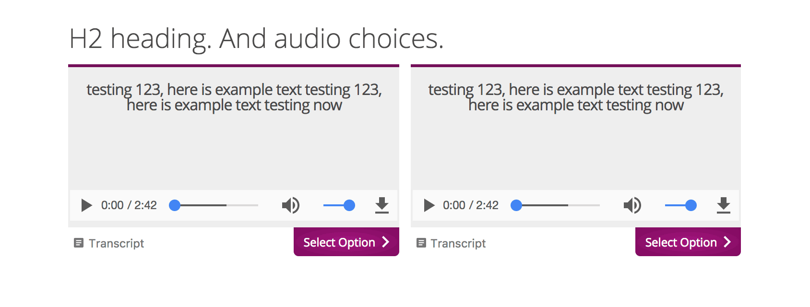
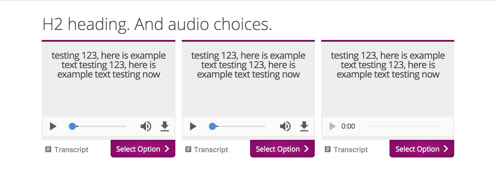
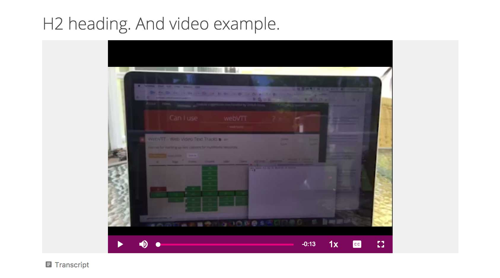
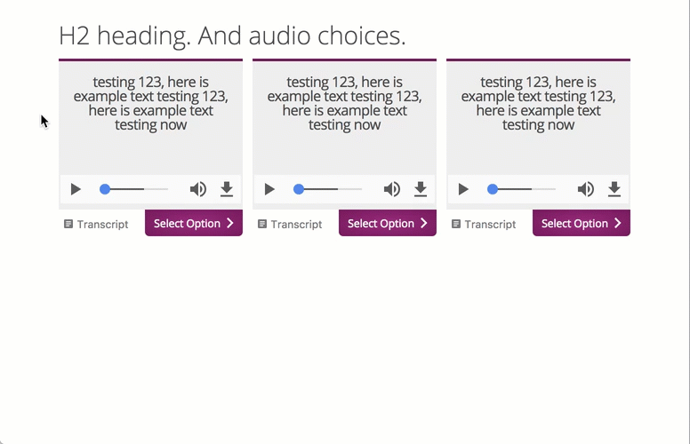

# ART-transcript-patterns

This respository contains UI patterns for Audio Record Tool (ART) layouts, and a generic UI pattern for video layouts leveraging VideoJS with transcripts support

The directory structure of this repo is purposeful; it maps to the directory structure found in ePub files created by [Sigil ePub editor](https://sigil-ebook.com/)

## Available layouts

There are three available transcript layout pattern, a 2-up layout, a 3-up layout and a single video layout. The 2-up and 3-up layouts are mobile responsive with a breakpoint set at a max viewport width of 767px. The video layout is currently not set to be responsive.

### 2-up layout

Here is an example image of the 2-up ART layout

### 3-up layout

Here is an example image of the 3-up ART layout

### video layout

Here is an example image of the video layout

## Pattern Accessibility

These UI patterns are intended to be accessible for the web. All three examples pass WCAG AA color contrast specifications, and are navigable by keyboard as well as by mouse.

The video pattern includes captions as well as transcripts. The transcript in the video does not match the example video. It is used for illustrative purposes to show how a transcript should work.

When navigating by keyboard, the user should see the following focus styles as indicated in this example gif animation. These focus styles will not be present when navigating the UI by mouse only.

## Acknowledgments
This software uses many third-party software packages, and the authors are grateful
for every one. All third-party software remains copyright by the respective author(s) and may have
different license requirements than this software.

The authors would like to acknowledge the use of the following packages:

### Front-end CSS / fonts
- Rich Clark / Eric Meyer (HTML5 reset CSS; CC BY-NC 2.0 UK)
- Graham Miller (Responsive Grid System; CC BY 3.0)
- Font Squirrel (OpenSans fonts; licensed Apache V2)
- Joe Prince, Adminx Designs (Varela; SIL OPEN FONT LICENSE Version 1.1)
